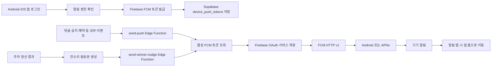
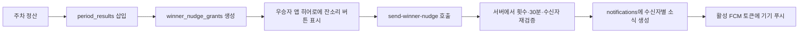

# 앱 푸시 적용·운영 가이드

- 문서 상태: iOS·Android FCM 직접 발송 및 Supabase 반영 완료
- 최종 반영: 2026-09-12
- 대상: Android·iOS / Firebase FCM HTTP v1 / Supabase Edge Functions
- 네이티브 변경: 새 EAS development/release build 필요 (OTA만으로는 적용되지 않음)

이 문서는 자린고비 앱의 원격 푸시가 어떤 구조로 동작하는지, 이후 자동·전체·예약 발송을 어디에 연결해야 하는지를 정리한다. 실제 Push Token, APNs `.p8` 키, Supabase secret key는 이 문서나 Git에 기록하지 않는다.

## 1. 현재 구현 상태

| 항목 | 상태 | 설명 |
|---|---|---|
| Firebase APNs 자격증명 | 사용자 설정 완료 | Firebase Console에 APNs `.p8` 업로드 |
| 앱 알림 권한·FCM 토큰 등록 | 코드 완료 | 로그인한 Android·iOS 사용자 등록 |
| 기기별 토큰 갱신 | 코드 완료 | iOS IDFV / Android ID를 `device_id`에 저장 |
| 토큰 데이터 정리 | 코드 완료 | 만료·무효 FCM 토큰 자동 비활성화 |
| 수동 수신 테스트 | 새 네이티브 빌드 후 필요 | Android·iOS 실기기에서 FCM 수신 확인 |
| 내부 발송 Function | 배포 완료 | FCM Secret 설정 후 네 개 Function 원격 배포 완료 |
| 특정 사용자·전체 발송 | 준비 완료 | 내부 서비스 또는 크론이 Function을 호출 |
| 지난 주차 1위 잔소리 | 완료 | 정산 결과 기반 발송권·소식함·기기 푸시까지 연결 |
| 방 공지 자동 푸시 | 완료 | 공지 소식함 행을 기준으로 같은 방 수신자 기기에 전달 |
| 24시간 활동 리마인더 | 구현 완료 | 앱 미접속·게시글 미작성 상태를 DB에서 판정해 KST 09:00~21:00에 1회 전송 |
| 댓글·답글 자동 푸시 | 미구현 | `notifications` 이벤트 dispatcher를 별도 연결 예정 |
| 푸시 탭 이동 | 완료 | 모든 원격 푸시를 앱 홈으로 이동 |
| Android FCM | 원격 반영 완료·새 build 필요 | `google-services.json` 확인 완료, 새 Android build 필요 |

## 2. 전체 구조



발송 서버는 Firebase 서비스 계정으로 FCM HTTP v1을 호출한다. FCM이 Android에는 직접 전달하고, iOS에는 Firebase에 등록한 APNs 자격증명을 사용해 APNs로 전달하므로 두 플랫폼을 같은 발송 함수에서 처리한다.

## 3. 앱의 토큰 등록 흐름

관련 파일:

- `src/shared/services/push-notifications.ts`
- `src/shared/providers/push-notification-provider.tsx`
- `src/shared/providers/session-provider.tsx`

### 3.1 등록 조건

1. Android 또는 iOS 네이티브 기기에서 앱을 실행한다.
2. 사용자가 로그인한다.
3. 앱이 알림 권한을 확인하고, 필요하면 시스템 권한 팝업을 표시한다.
4. 허용된 경우에만 Firebase Messaging의 `getToken()`으로 FCM 등록 토큰을 얻는다.
5. iOS IDFV 또는 Android ID를 읽어 `ios:<IDFV>` / `android:<Android ID>` 형식의 `device_id`를 만든다.
6. `claim_device_push_token` RPC가 토큰을 현재 로그인 계정으로 연결한다. 같은 iPhone에서 계정을 바꾸면 이전 계정 연결을 끊고 새 계정으로 이전한다.

기기 식별자를 일시적으로 가져오지 못하면 저장을 건너뛰고 다음 앱 실행에서 재시도한다. FCM 토큰이 앱 실행 중 바뀌는 경우에도 `onTokenRefresh`가 같은 저장 함수를 다시 호출한다.

### 3.2 왜 token이 아니라 device_id를 기준으로 갱신하는가

FCM 토큰은 재설치, 앱 데이터 삭제, 제공자 측 토큰 갱신으로 바뀔 수 있다. 토큰 자체를 행의 식별자로 쓰면 동일 기기에 과거 토큰이 계속 쌓인다.

`device_id`를 기준으로 현재 토큰을 update하면 다음 상태를 유지한다.

```text
동일 사용자 + 동일 기기 + 플랫폼 = 활성 토큰 행 1개
동일 사용자 + 다른 기기          = 각각 활성 토큰 행 1개
```

기존 앱 버전의 Expo 토큰 행은 새 FCM 발송 대상에서 제외된다. 같은 기기에서 새 FCM 토큰을 등록하면 RPC가 기존의 동일 기기 행을 정리하며, `device_id = null`인 과거 행은 발송 대상이 아니므로 즉시 삭제할 필요는 없다.

한 기기에서 본계정과 테스트계정을 번갈아 로그인하는 경우에도 FCM 토큰 자체는 바뀌지 않을 수 있다. 이때 RPC가 토큰의 `user_id`만 현재 계정으로 이전하므로, 기기 알림은 현재 로그인한 계정에 대해서만 수신한다.

### 3.3 로그아웃과 탈퇴

- 로그아웃: 현재 기기의 현재 FCM 토큰만 `is_enabled = false`로 바꾼다. 다른 기기의 토큰은 유지한다.
- 계정 탈퇴: 기존 `delete-account` Function이 `device_push_tokens` 행도 삭제한다.

## 4. `device_push_tokens` 데이터 규칙

중요 열은 아래와 같다.

| 열 | 의미 | 운영 규칙 |
|---|---|---|
| `user_id` | 수신자 계정 | 앱 사용자는 자신의 행만 접근 |
| `platform` | `ios` 또는 `android` | 발송 플랫폼 구분 |
| `token` | Firebase FCM Token | 옛 `ExponentPushToken[...]`은 발송 대상에서 제외 |
| `device_id` | `ios:<IDFV>` 또는 `android:<Android ID>` | 같은 기기 행을 갱신하는 기준 |
| `is_enabled` | 수신 가능 여부 | `true`인 행만 발송 |
| `last_seen_at` | 마지막 등록 시각 | 토큰 상태 점검에 사용 |

DB에는 `(user_id, platform, device_id)` 유니크 인덱스가 있다. `device_id`가 `null`인 과거 행은 SQL의 `NULL` 특성상 여러 개 존재할 수 있으므로, 새 앱 코드는 항상 플랫폼별 기기 식별자를 채워 저장한다.

### 4.1 운영 점검 SQL

현재 발송 가능한 토큰을 확인한다.

```sql
select
  user_id,
  platform,
  device_id,
  is_enabled,
  last_seen_at
from public.device_push_tokens
where is_enabled = true
  and token not like 'ExponentPushToken[%]'
order by last_seen_at desc;
```

실기기에서 새 네이티브 빌드를 설치한 뒤에는 활성 행의 `device_id`가 `ios:` 또는 `android:`로 시작해야 한다.

```sql
select token, device_id, is_enabled, last_seen_at
from public.device_push_tokens
where is_enabled = true
order by last_seen_at desc;
```

## 5. `send-push` Edge Function

관련 파일:

- `supabase/functions/send-push/index.ts`
- `supabase/functions/send-push/deno.json`
- `supabase/config.toml`

운영 Supabase에는 `send-push` Function 설정과 FCM Secret이 유지되며, FCM 직접 발송 코드가 원격에 배포되어 있다.

### 5.1 호출 권한

`send-push`는 앱에서 호출하지 않는다. `verify_jwt = false`이지만 Function 내부의 `withSupabase({ auth: 'secret' })`가 **project secret API key**를 요구한다. 인증 헤더 없이 호출하면 `401`이어야 한다.

따라서 다음만 호출 권한을 가져야 한다.

- 신뢰할 수 있는 서버 작업
- Supabase Cron 또는 Database Webhook
- 관리자 전용 운영 도구

앱 코드, `EXPO_PUBLIC_*` 환경 변수, Git 저장소에 secret key를 넣으면 안 된다.

### 5.2 요청 형식

특정 사용자에게 보낸다.

```json
{
  "audience": "user",
  "userId": "사용자-UUID",
  "title": "새 댓글이 있어요",
  "body": "지출 기록에 댓글이 달렸어요.",
  "data": {
    "route": "/notifications"
  }
}
```

모든 활성 토큰에 보낸다.

```json
{
  "audience": "all",
  "title": "공지",
  "body": "새로운 안내를 확인해 주세요.",
  "data": {
    "route": "/notifications"
  }
}
```

### 5.3 서버 측 안전장치

Function은 다음을 모두 만족하는 토큰만 조회한다.

```text
is_enabled = true
platform IN ('ios', 'android')
공백이 없고 옛 ExponentPushToken 접두사가 아닌 FCM 토큰
```

FCM HTTP v1은 토큰별 단건 요청을 사용하며, Function은 한 번에 20개씩 병렬 처리한다. 인증·프로젝트 오류는 재시도를 위해 실패로 반환하고, FCM이 무효로 판정한 토큰만 자동 비활성화한다.

기존 발송 API의 payload 경로 데이터는 호환성을 위해 제한해서 받지만, 현재 앱은 어떤 payload든 탭하면 홈으로 이동한다.

| 허용 값 | 용도 |
|---|---|
| `/` | 앱 홈 (현재 모든 푸시 탭의 최종 목적지) |
| `/notifications` | 알림함 |
| `/expense/<id>` | 지출 상세 |
| `/community/<id>` | 커뮤니티 글 상세 |
| `commentId` | 지출 상세 경로에만 허용 |

따라서 외부 URL이나 임의 앱 경로를 push payload로 열 수 없다.

### 5.4 발송 결과와 토큰 비활성화

FCM 응답의 `UNREGISTERED` 또는 토큰에 대한 `INVALID_ARGUMENT`가 오면 해당 행을 `is_enabled = false`로 바꾼다. 성공 응답의 `name`은 진단용 `messageNames`로 반환하며 Expo ticket/receipt 조회는 사용하지 않는다.

## 6. 테스트 절차

### 6.1 앱 토큰 등록 확인

1. 새 EAS development 또는 release build를 Android·iOS 실기기에 설치한다.
2. 로그인하고 알림 권한을 허용한다.
3. SQL Editor에서 활성 행의 `platform`, `device_id`, `last_seen_at`을 확인한다.

### 6.2 수동 수신 확인

`send-push`를 project secret으로 호출해 한 사용자에게 테스트한다. Android·iOS 각각 포그라운드, 백그라운드, 종료 상태에서 알림 표시와 탭 후 홈 이동을 점검한다.

### 6.3 Function 호출 확인

Function은 secret key가 있는 내부 호출자만 사용할 수 있다. 특정 사용자 테스트는 `audience: "user"`로 한 명에게만 보낸 뒤 응답의 `attempted`, `accepted`, `rejected`, `disabled` 값을 확인한다.

`accepted`는 FCM이 메시지를 접수했다는 의미다. 실제 기기 전달은 Android·iOS 수신 여부로 확인한다.

### 6.4 방 공지 자동 푸시 확인

1. Android와 iPhone 계정을 같은 방의 활성 멤버로 준비한다. 공지 작성자는 수신 대상에서 제외된다.
2. Android의 방장이 공지를 작성한다.
3. iPhone에서 `새 공지` 알림이 표시되고, 탭하면 앱 홈으로 이동하는지 확인한다.
4. iPhone 소식함에도 기존 공지 소식이 한 번만 쌓였는지 확인한다.

공지 푸시는 `notifications.kind = 'room_notice'` 행마다 DB webhook이 `deliver-room-notice-push` Edge Function을 호출해 전송한다. Function은 해당 소식의 수신자 토큰만 조회하므로 방 외부 사용자나 공지 작성자에게는 전달되지 않는다.

DB webhook은 secret key를 Git이나 Function 환경 변수에 두지 않고 Supabase Vault의 `room_notice_push_api_key`에서만 읽는다. `deliver-room-notice-push`와 `send-push`가 내부 조회에 필요한 `profiles`, `notifications`, `room_posts`, `device_push_tokens`의 최소 `service_role` 권한만 가진다. 이 권한은 모바일 앱 역할(`anon`·`authenticated`)에는 부여하지 않는다.

## 7. 지난 주차 1위 `잔소리` 발송

### 7.1 사용 규칙

- 정산 시점의 `period_results.is_crown = true` 결과만 권한 생성의 근거로 사용한다.
- 단독 1위는 다음 주차 종료 전까지 하루 최대 10회 보낼 수 있다.
- 공동 1위는 각자 한 번만 보낼 수 있다.
- 모든 발송 사이에는 30분의 간격이 필요하다.
- 수신자는 정산 당시 같은 방의 활성 참여자 스냅샷이며, 발송 시점에 방을 떠난 사용자는 제외한다.
- 발송 문구는 1~80자이며, 본인에게는 보내지 않는다.

### 7.2 구현 흐름



관련 파일:

- `supabase/migrations/20260907141247_add_winner_nudges.sql`
- `supabase/migrations/20260907142433_add_winner_nudge_realtime.sql`
- `supabase/functions/send-winner-nudge/index.ts`
- `src/features/winner-nudge/ui/winner-nudge-sheet.tsx`

정산 트리거가 `winner_nudge_grants`를 만들며, RLS로 우승자 본인만 읽을 수 있다. 이 테이블은 Realtime publication에 포함돼 정산 후 앱을 열어 둔 우승자에게도 버튼이 나타난다.

`send-winner-nudge`는 로그인한 사용자 요청만 받는다. DB RPC에서 현재 사용자·방·만료일·횟수·쿨다운을 잠금과 함께 검증한 뒤 소식함 행을 먼저 저장한다. 그 뒤 FCM 전송이 실패해도 이미 저장한 소식은 유지해 재시도로 중복 발송되지 않게 한다. 무효 FCM 토큰은 자동 비활성화한다.

### 7.3 기기 테스트 순서

1. 정산이 끝난 테스트 방에서 단독 또는 공동 1위 계정으로 로그인한다.
2. 히어로 카드 제목 아래에 `지난 주차 1위! · 잔소리`가 나타나는지 확인한다.
3. 문구를 입력해 보낸다. 같은 방의 다른 활성 참여자 기기에서 알림을 받고, 탭하면 앱 홈으로 이동하는지 확인한다.
4. 수신자 소식함에 `보낸 사람님의 잔소리: 문구`가 쌓였는지 확인한다.
5. 보낸 직후 발송 버튼이 비활성화되고 `30분 뒤에 다음 잔소리를 보낼 수 있습니다.`가 나타나는지 확인한다.
6. 단독 1위는 날짜 기준 10회 제한, 공동 1위는 1회 제한도 확인한다.

## 8. 24시간 활동 리마인더

활성 방 멤버 중에서 전역·방별 알림을 허용하고, 활성 FCM 토큰이 있는 사용자만 대상이다. 앱을 열거나 게시글·투표를 작성하면 활동 기준 시각이 갱신된다. 두 활동 모두 24시간 이상 없을 때 KST 09:00~21:00 사이에 한 번만 원격 푸시를 보낸다. 푸시를 탭하면 payload와 관계없이 홈으로 이동한다.

관련 파일:

- `supabase/migrations/20260912065845_engagement_reminders.sql`
- `supabase/functions/deliver-engagement-nudges/index.ts`
- `src/shared/services/engagement-activity.ts`
- `src/shared/providers/push-notification-provider.tsx`

`private.user_engagement_state`가 마지막 앱 활동·게시글 시각을 보관하고, `private.engagement_nudge_events`가 중복 방지·선점·발송 상태를 보관한다. Supabase Cron이 5분마다 대상자를 선점한 뒤 `deliver-engagement-nudges`가 FCM HTTP v1을 호출한다. DB 트랜잭션 안에서 외부 HTTP를 호출하지 않으며, worker가 큐를 가져간 뒤 토큰별로 전송한다.

기존 방 공지와 동일하게 Vault의 `room_notice_push_api_key`를 사용한다. 운영 DB migration과 `deliver-engagement-nudges` 배포가 완료되어 Cron이 동작한다. 기존 사용자에게는 migration 시각부터 24시간의 유예가 있다.

## 9. 배포 규칙

| 변경 | 필요한 배포 |
|---|---|
| 화면·토큰 동기화 같은 JS/TS 변경 | EAS Update (OTA) |
| RNFirebase/`expo-build-properties` plugin, Android·iOS 네이티브 설정 변경 | 새 EAS Android·iOS Build 필요 |
| 일반 Edge Function 또는 `_shared/fcm.ts` 변경 | 네 개 FCM 발송 Function 재배포 |
| 스키마/RLS 변경 | migration 생성 후 운영 DB 반영 |

현재 OTA는 `production` 채널·runtime `1.0.3`에 배포되어 있다. OTA는 동일 runtime의 설치 빌드에만 적용된다.

## 10. 다음 확장 순서

1. **실기기**: 새 Android·iOS build 설치 후 포그라운드·백그라운드·종료 상태 테스트
2. **특정 사용자·전체 공지**: 내부 서버가 `audience: "user"` 또는 `audience: "all"` 호출

자동·전체 발송을 앱 클라이언트에서 직접 호출하게 만들지 않는다. 수신자 선택과 권한 판정은 반드시 신뢰할 수 있는 서버 작업에서 수행한다.

## 11. 문제 해결 체크리스트

| 증상 | 확인할 항목 |
|---|---|
| 토큰 행이 생성되지 않음 | 로그인 여부, 알림 권한, TestFlight/개발 빌드 사용 여부, 네트워크 |
| `device_id`가 비어 있음 | 새 네이티브 build 실행, 기기 잠금 해제 후 재시도 |
| 알림이 중복 도착 | FCM 알림 payload와 별도의 local notification을 동시에 예약하지 않았는지 확인 |
| Function이 401 | `apikey` 헤더에 project secret key를 사용했는지 확인 |
| Function이 502 | `FCM_SERVICE_ACCOUNT_JSON`, Firebase Messaging API, DB webhook의 Vault key 존재 여부 확인 |
| Function이 400 | `audience`, UUID, 제목·본문 길이, 허용된 `data.route` 확인 |
| Function 응답은 성공인데 기기 수신 실패 | 앱 권한, Firebase의 APNs key, `google-services.json`, 기기 네트워크 확인 |
| 푸시 탭 후 홈으로 가지 않음 | 새 build 적용 여부와 `PushNotificationProvider`의 FCM listener 확인 |
