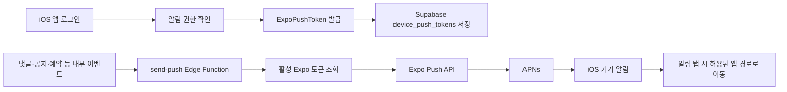

# 앱 푸시 적용·운영 가이드

- 문서 상태: iOS 1차 구현 완료
- 최종 반영: 2026-09-07
- 대상: iOS / Expo Push Service / Supabase Edge Functions
- 현재 iOS OTA 그룹: `67db8b51-92a2-48ae-ad34-10f54d02e446`

이 문서는 자린고비 앱의 원격 푸시가 어떤 구조로 동작하는지, 이후 자동·전체·예약 발송을 어디에 연결해야 하는지를 정리한다. 실제 Push Token, APNs `.p8` 키, Supabase secret key는 이 문서나 Git에 기록하지 않는다.

## 1. 현재 구현 상태

| 항목 | 상태 | 설명 |
|---|---|---|
| iOS APNs 자격증명 | 완료 | EAS 원격 credentials에 연결됨 |
| 앱 알림 권한·Expo 토큰 등록 | 완료 | 로그인한 iOS 사용자만 등록 |
| 기기별 토큰 갱신 | 완료 | iOS IDFV를 `device_id`에 저장 |
| 토큰 데이터 정리 | 완료 | 원시 APNs 토큰 제거, 이전 Expo 토큰 비활성화 |
| 수동 수신 테스트 | 완료 | Expo Push Tool로 실기기 수신 확인 |
| 내부 발송 Function | 완료 | `send-push` Edge Function 배포·활성화 |
| 특정 사용자·전체 발송 | 준비 완료 | 내부 서비스 또는 크론이 Function을 호출 |
| 이벤트·예약 발송 연결 | 미구현 | 제품 이벤트와 시간 규칙을 정한 뒤 연결 |
| Android FCM | 미구현 | Android 작업 시 Firebase FCM v1 설정 필요 |

## 2. 전체 구조



발송 서버는 APNs에 직접 연결하지 않는다. `send-push`가 Expo Push API로 Expo Push Token을 보내면, Expo가 iOS는 APNs로 전달한다. Android를 추가할 때도 앱과 서버의 발송 인터페이스는 유지하고 Expo가 FCM으로 전달한다.

## 3. 앱의 토큰 등록 흐름

관련 파일:

- `src/shared/services/push-notifications.ts`
- `src/shared/providers/push-notification-provider.tsx`
- `src/shared/providers/session-provider.tsx`

### 3.1 등록 조건

1. iOS 기기에서 앱을 실행한다.
2. 사용자가 로그인한다.
3. 앱이 알림 권한을 확인하고, 필요하면 시스템 권한 팝업을 표시한다.
4. 허용된 경우에만 `getExpoPushTokenAsync()`로 `ExponentPushToken[...]` 값을 얻는다.
5. iOS IDFV를 읽어 `ios:<IDFV>` 형식의 `device_id`를 만든다.
6. `user_id + platform + device_id`가 같은 행이 있으면 토큰을 갱신하고, 없으면 새 행을 만든다.

IDFV가 iOS 재시작 직후 잠금 상태 등으로 일시적으로 `null`이면 저장을 건너뛰고 다음 앱 실행에서 재시도한다. 기기 토큰이 앱 실행 중 바뀌는 경우에도 push token listener가 같은 저장 함수를 다시 호출한다.

### 3.2 왜 token이 아니라 device_id를 기준으로 갱신하는가

Expo Push Token은 재설치, APNs Sandbox/Production 전환, 제공자 측 토큰 갱신으로 바뀔 수 있다. 토큰 자체를 행의 식별자로 쓰면 동일 기기에 과거 토큰이 계속 쌓인다.

`device_id`를 기준으로 현재 토큰을 update하면 다음 상태를 유지한다.

```text
동일 사용자 + 동일 iPhone + iOS = 활성 토큰 행 1개
동일 사용자 + 다른 iPhone            = 각각 활성 토큰 행 1개
```

기존 앱 버전이 `device_id = null`로 저장한 현재 Expo 토큰은, 새 코드가 처음 실행될 때 같은 행에 `device_id`를 채워 이관한다. 비활성화된 과거 행은 `device_id = null`이어도 발송 대상이 아니므로 즉시 삭제할 필요는 없다.

### 3.3 로그아웃과 탈퇴

- 로그아웃: 현재 기기의 현재 Expo 토큰만 `is_enabled = false`로 바꾼다. 다른 기기의 토큰은 유지한다.
- 계정 탈퇴: 기존 `delete-account` Function이 `device_push_tokens` 행도 삭제한다.

## 4. `device_push_tokens` 데이터 규칙

중요 열은 아래와 같다.

| 열 | 의미 | 운영 규칙 |
|---|---|---|
| `user_id` | 수신자 계정 | 앱 사용자는 자신의 행만 접근 |
| `platform` | `ios` 또는 향후 `android` | 발송 플랫폼 구분 |
| `token` | Expo Push Token | `ExponentPushToken[...]`만 Expo 발송 대상 |
| `device_id` | `ios:<IDFV>` | 같은 기기 행을 갱신하는 기준 |
| `is_enabled` | 수신 가능 여부 | `true`인 행만 발송 |
| `last_seen_at` | 마지막 등록 시각 | 토큰 상태 점검에 사용 |

DB에는 `(user_id, platform, device_id)` 유니크 인덱스가 있다. `device_id`가 `null`인 과거 행은 SQL의 `NULL` 특성상 여러 개 존재할 수 있으므로, 새 앱 코드는 항상 IDFV를 채워 저장한다.

### 4.1 운영 점검 SQL

현재 발송 가능한 토큰을 확인한다.

```sql
select
  user_id,
  platform,
  device_id,
  is_enabled,
  last_seen_at
from public.device_push_tokens
where is_enabled = true
  and token like 'ExponentPushToken[%]'
order by last_seen_at desc;
```

실기기에서 새 OTA를 받은 뒤에는 활성 행의 `device_id`가 `ios:`로 시작해야 한다.

```sql
select token, device_id, is_enabled, last_seen_at
from public.device_push_tokens
where is_enabled = true
order by last_seen_at desc;
```

## 5. `send-push` Edge Function

관련 파일:

- `supabase/functions/send-push/index.ts`
- `supabase/functions/send-push/deno.json`
- `supabase/config.toml`

운영 Supabase에는 `send-push` Function이 배포되어 활성 상태다.

### 5.1 호출 권한

`send-push`는 앱에서 호출하지 않는다. `verify_jwt = false`이지만 Function 내부의 `withSupabase({ auth: 'secret' })`가 **project secret API key**를 요구한다. 인증 헤더 없이 호출하면 `401`이어야 한다.

따라서 다음만 호출 권한을 가져야 한다.

- 신뢰할 수 있는 서버 작업
- Supabase Cron 또는 Database Webhook
- 관리자 전용 운영 도구

앱 코드, `EXPO_PUBLIC_*` 환경 변수, Git 저장소에 secret key를 넣으면 안 된다.

### 5.2 요청 형식

특정 사용자에게 보낸다.

```json
{
  "audience": "user",
  "userId": "사용자-UUID",
  "title": "새 댓글이 있어요",
  "body": "지출 기록에 댓글이 달렸어요.",
  "data": {
    "route": "/notifications"
  }
}
```

모든 활성 토큰에 보낸다.

```json
{
  "audience": "all",
  "title": "공지",
  "body": "새로운 안내를 확인해 주세요.",
  "data": {
    "route": "/notifications"
  }
}
```

### 5.3 서버 측 안전장치

Function은 다음을 모두 만족하는 토큰만 조회한다.

```text
is_enabled = true
token LIKE 'ExponentPushToken[%]'
정규식으로 Expo 토큰 형식 재검증
```

원시 APNs 16진수 토큰은 Expo Push API에 전송되지 않는다. 발송은 Expo 제한에 맞춰 요청당 100개씩 분할한다.

딥링크 데이터도 서버에서 제한한다.

| 허용 값 | 용도 |
|---|---|
| `/notifications` | 알림함 |
| `/expense/<id>` | 지출 상세 |
| `/community/<id>` | 커뮤니티 글 상세 |
| `commentId` | 지출 상세 경로에만 허용 |

앱에서도 같은 경로를 다시 검증하므로, 외부 URL이나 임의 앱 경로를 push payload로 열 수 없다.

### 5.4 발송 결과와 토큰 비활성화

Expo의 즉시 응답에서 `DeviceNotRegistered`가 오면 해당 행을 `is_enabled = false`로 바꾼다. 앱 삭제, 권한 철회처럼 비동기 전달 결과에 의한 실패까지 엄밀히 반영하려면 다음 확장 단계에서 Expo ticket ID를 별도 테이블에 저장하고 Push Receipt API를 조회하는 worker를 추가한다.

## 6. 테스트 절차

### 6.1 앱 토큰 등록 확인

1. TestFlight의 iOS `1.0.3` 빌드를 연다.
2. 한 번 실행해 OTA를 받고, 앱을 종료·재실행해 OTA를 적용한다.
3. 로그인하고 알림 권한을 허용한다.
4. SQL Editor에서 활성 행의 `device_id`가 `ios:`로 시작하는지 확인한다.

### 6.2 수동 수신 확인

개발 초기에는 Expo Push Tool에 활성 `ExponentPushToken[...]` 하나를 넣어 수신을 확인한다. 앱이 열린 상태, 백그라운드 상태, 종료 상태에서 각각 알림 표시와 탭 후 화면 이동을 점검한다.

### 6.3 Function 호출 확인

Function은 secret key가 있는 내부 호출자만 사용할 수 있다. 특정 사용자 테스트는 `audience: "user"`로 한 명에게만 보낸 뒤 응답의 `attempted`, `accepted`, `rejected`, `disabled` 값을 확인한다.

`accepted`는 Expo가 요청을 접수했다는 의미다. 실제 APNs 전달까지 확인하려면 기기 수신을 확인하거나 향후 Receipt worker를 추가한다.

## 7. 배포 규칙

| 변경 | 필요한 배포 |
|---|---|
| 화면·토큰 동기화 같은 JS/TS 변경 | EAS Update (OTA) |
| `expo-notifications` plugin, iOS 권한, 새 네이티브 모듈 변경 | 새 EAS iOS Build + TestFlight 제출 |
| Edge Function 코드 변경 | `supabase functions deploy send-push` |
| 스키마/RLS 변경 | migration 생성 후 운영 DB 반영 |

현재 OTA는 `production` 채널·runtime `1.0.3`에 배포되어 있다. OTA는 동일 runtime의 설치 빌드에만 적용된다.

## 8. 다음 확장 순서

1. **특정 사용자 이벤트**: 댓글·답글·초대 등 이벤트가 생길 때 내부 서버가 `audience: "user"` 호출
2. **전체 공지**: 관리자 운영 도구가 `audience: "all"` 호출
3. **영수증 처리**: ticket ID 저장 테이블과 receipt worker를 추가해 죽은 토큰 자동 비활성화 강화
4. **예약 발송**: 발송 예약 테이블 + Supabase Cron으로 정해진 시각에 `send-push` 호출
5. **Android**: Firebase FCM v1 자격증명 설정, Android 기기 식별자 처리, 실기기 수신 테스트

자동·전체 발송을 앱 클라이언트에서 직접 호출하게 만들지 않는다. 수신자 선택과 권한 판정은 반드시 신뢰할 수 있는 서버 작업에서 수행한다.

## 9. 문제 해결 체크리스트

| 증상 | 확인할 항목 |
|---|---|
| 토큰 행이 생성되지 않음 | 로그인 여부, 알림 권한, TestFlight/개발 빌드 사용 여부, 네트워크 |
| `device_id`가 비어 있음 | 최신 OTA 적용 후 앱 재실행, iPhone 잠금 해제 후 재시도 |
| 알림이 중복 도착 | 활성 Expo 토큰이 동일 기기에 여러 개인지 확인 |
| Function이 401 | `apikey` 헤더에 project secret key를 사용했는지 확인 |
| Function이 400 | `audience`, UUID, 제목·본문 길이, 허용된 `data.route` 확인 |
| Function 응답은 성공인데 기기 수신 실패 | 앱 권한, APNs credentials, Expo ticket/receipt, 기기 네트워크 확인 |
| 푸시 탭 후 잘못된 화면 이동 | payload의 `data.route`가 허용 경로인지 확인 |

