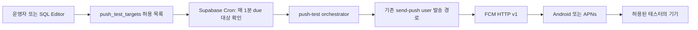

# 특정 테스터 전용 푸시 테스트 모드 설계

- 문서 상태: 설계 제안
- 작성일: 2026-09-09
- 대상: Android·iOS FCM 직접 발송

## 1. 결론

가능하다.

현재 앱에는 이미 다음 기반이 있다.

- 로그인한 Android·iOS 사용자의 FCM 토큰을 `device_push_tokens`에 저장한다.
- 토큰이 바뀌면 `onTokenRefresh`로 서버에 다시 동기화한다.
- `send-push` Edge Function이 서버 전용 secret으로 인증된 요청만 받고, `audience: "user"`로 한 사용자에게만 발송한다.
- 발송 대상은 `is_enabled = true`인 토큰으로 제한되며, FCM이 `UNREGISTERED`로 응답한 토큰은 비활성화한다.

따라서 실기기 푸시 경로를 확인하기 위해 특정 테스터 계정에만 반복 푸시를 보내는 기능을 추가할 수 있다. 다만 “무기한 무제한 발송”은 사고 시 푸시 폭탄으로 이어질 수 있으므로, 서버에서만 켤 수 있고 반드시 만료 시각과 발송 간격을 갖게 한다.

## 2. 추천 범위

### MVP

1. 서버에 특정 테스터 계정을 허용 목록으로 등록한다.
2. 허용 목록의 테스트 대상에 한 번 보내기(`send_once`)를 제공한다.
3. 테스트 대상별 반복 발송을 켜면 Supabase Cron이 정해진 간격으로 푸시한다.
4. 만료 시각에 도달하거나 운영자가 끄면 즉시 중단한다.
5. 테스트 푸시는 `notifications` 소식함 행을 만들지 않고, 순수 원격 푸시 전달 경로만 검사한다.

### MVP에서 제외

- 앱 안에 일반 사용자가 접근할 수 있는 “푸시 무한 발송” 화면을 만들지 않는다.
- 실제 사용자의 댓글·지출 내용이나 개인정보를 테스터에게 복제하지 않는다.
- 운영 이벤트를 무조건 테스터에게 복제하지 않는다.

실제 이벤트와 소식함까지 검증하려면 별도의 QA 계정·QA 방에서 댓글, 공지 등 정상 이벤트를 발생시키는 방식이 안전하다.

## 3. 제안 구조



핵심은 테스트 대상 선택을 클라이언트 요청에 맡기지 않는 것이다. `send-push`의 secret은 계속 서버에만 두고, 반복 발송 함수는 허용 목록에 있는 대상만 해석한다.

## 4. 데이터 모델

실제 migration은 구현 승인 후 추가한다. 권장 위치는 모바일 API에 노출되지 않는 `private` 스키마다.

### `private.push_test_targets`

| 필드 | 설명 |
|---|---|
| `id` | 테스트 대상 식별자 |
| `user_id` | 수신자 계정 UUID |
| `device_id` | 선택값. 특정 기기만 고정할 때 사용하며 현재 `ios:<IDFV>` 형식과 맞춘다 |
| `label` | 운영자가 알아보기 위한 이름 |
| `enabled` | 반복 발송 활성화 여부 |
| `interval_seconds` | 발송 간격. 최소 60초, 기본 300초 권장 |
| `expires_at` | 필수 만료 시각 |
| `next_run_at` | 다음 발송 예정 시각 |
| `last_attempt_at` | 마지막 발송 시도 시각 |
| `last_status` | 마지막 결과 요약 |
| `created_at`, `updated_at` | 운영 추적용 시각 |

MVP에서는 `device_id`를 비워 계정의 모든 활성 기기를 대상으로 할 수 있다. 특정 기기 한 대만 검사해야 할 때만 `device_id`를 채운다. FCM 토큰 원문을 별도 테이블에 복사하지 않고 기존 `device_push_tokens`를 조회한다.

선택적으로 `private.push_test_runs`를 두어 `attempted`, `accepted`, `rejected`, `disabled`, 오류 코드와 실행 시각을 남긴다. 푸시 본문이나 token 원문은 로그에 저장하지 않는다.

## 5. 발송 API와 실행 방식

### 5.1 한 번 보내기

새로운 좁은 범위의 `push-test` Edge Function을 추가한다.

```json
{
  "targetId": "허용 목록 UUID",
  "action": "send_once"
}
```

함수는 다음을 확인한다.

1. 요청이 project secret으로 인증됐는지 확인한다.
2. `targetId`가 `push_test_targets`에 있고, 활성 상태이며, 만료되지 않았는지 확인한다.
3. `device_push_tokens`에서 해당 `user_id`와 선택적 `device_id`에 매칭되는 활성 FCM 토큰만 조회한다.
4. 제목과 본문은 서버가 고정한 테스트 문구를 사용한다.
5. 기존 `send-push`의 배치 발송·실패 토큰 비활성화 규칙을 재사용한다.

테스트 문구 예시는 다음과 같다.

```text
제목: 푸시 테스트
본문: 원격 푸시 수신 확인 · 2026-09-09 12:34:56
data.route: /
```

테스트 푸시에는 사용자 콘텐츠를 넣지 않는다. `/notifications` 이동만으로 포그라운드 표시, 백그라운드 수신, 종료 상태 수신, 탭 후 라우팅을 확인할 수 있다.

### 5.2 반복 발송

Supabase Cron을 1분 주기로 실행하고, due 상태인 대상만 잠금과 함께 가져온다.

```text
enabled = true
expires_at > now()
next_run_at <= now()
```

동시 실행 중복을 막기 위해 `FOR UPDATE SKIP LOCKED` 방식으로 대상을 선점하고, 선점한 즉시 `next_run_at`을 다음 시각으로 이동한다. 네트워크 호출은 DB 트랜잭션을 오래 점유하지 않도록 `pg_net`으로 `push-test`를 호출한다.

권장 기본값은 5분 간격, 최대 24시간 또는 7일 만료다. 실제 운영에서는 테스트 시작 시 만료 시각을 항상 명시한다.

### 5.3 중지

- 운영자가 `enabled = false`로 바꾸면 다음 실행부터 발송하지 않는다.
- `expires_at`이 지나면 자동으로 비활성화한다.
- 대상 사용자가 탈퇴하거나 FCM이 토큰을 `UNREGISTERED`로 판정하면 해당 토큰은 기존 규칙대로 발송 대상에서 제거한다.

## 6. 보안 및 개인정보 보호

- mobile bundle, `EXPO_PUBLIC_*`, OTA 코드에 project secret 또는 service role key를 넣지 않는다.
- `push_test_targets`에는 authenticated/anon용 RLS 정책과 쓰기 권한을 만들지 않는다.
- 대상 UUID만 알고 있어도 발송할 수 없도록 Edge Function 인증과 허용 목록 조회를 모두 요구한다.
- `audience: "all"` 경로는 테스트 기능에서 허용하지 않는다.
- 실제 서비스 이벤트를 테스터에게 복사하는 mirror 모드는 MVP에서 제공하지 않는다. 필요한 경우에도 본문을 제거한 이벤트 타입·라우트만 복제하고, 만료·속도 제한·전역 kill switch를 둔다.
- iOS 시스템 알림 권한이 꺼져 있으면 서버가 강제로 표시할 수 없다. 테스트 대상 기기는 알림 권한이 허용된 TestFlight 또는 development build여야 한다.

## 7. 테스트 시나리오

1. 테스트 계정으로 실기기 앱에 로그인하고 알림 권한을 허용한다.
2. `device_push_tokens`에서 해당 계정의 활성 토큰과 `device_id`를 확인한다.
3. `send_once`로 한 번 보내고, FCM 접수 결과와 기기 수신을 각각 확인한다.
4. 앱 포그라운드, 백그라운드, 완전 종료 상태에서 각각 확인한다.
5. 알림을 탭해 앱 홈으로 이동하는지 확인한다.
6. 5분 반복 모드를 켜고 2~3회 수신 간격을 확인한다.
7. 반복 모드를 끄고 더 이상 수신되지 않는지 확인한다.
8. 만료 시각 이후 자동 중지되는지 확인한다.
9. 테스트 기기에서 앱을 삭제하거나 토큰을 무효화한 뒤 해당 행이 비활성화되는지 확인한다.

## 8. 구현 순서

1. `private.push_test_targets` migration 및 권한 추가
2. 테스트 대상 조회·선점·중지 SQL 함수 추가
3. `push-test` Edge Function 추가
4. Cron과 Vault 기반 내부 호출 연결
5. `send-push`와 공통화할 토큰 조회·FCM 응답 처리 정리
6. Edge Function 단위 테스트와 SQL 동시 실행 테스트 추가
7. 운영 SQL 예시와 중지 절차 문서화
8. 테스트 계정 한 개로 staging/production에서 단계별 검증

## 9. 수용 기준

- 허용 목록에 없는 사용자에게는 한 건도 전송되지 않는다.
- 테스트 대상이 두 기기를 가지고 있어도 `device_id` 설정에 따라 계정 전체 또는 한 기기로만 제한된다.
- Cron이 중복 실행돼도 동일 시각에 중복 발송하지 않는다.
- 만료 시각이 지나면 자동 발송이 멈춘다.
- 테스트 푸시가 앱의 소식함 데이터를 오염시키지 않는다.
- 운영 로그에 token 원문이나 사용자 콘텐츠가 남지 않는다.
- 모바일 앱에는 새로운 secret이나 테스트 전용 발송 권한이 들어가지 않는다.

## 10. 현재 구조에서의 영향

기존 토큰 등록 및 앱 수신 코드를 재사용한다. Android·iOS 모두 FCM 토큰을 등록하므로 같은 테스트 대상 모델로 두 플랫폼을 검증할 수 있다.

FCM 직접 발송은 네이티브 Firebase Messaging 모듈을 필요로 하므로 Expo Go가 아닌 development/release build에서 검증한다.
